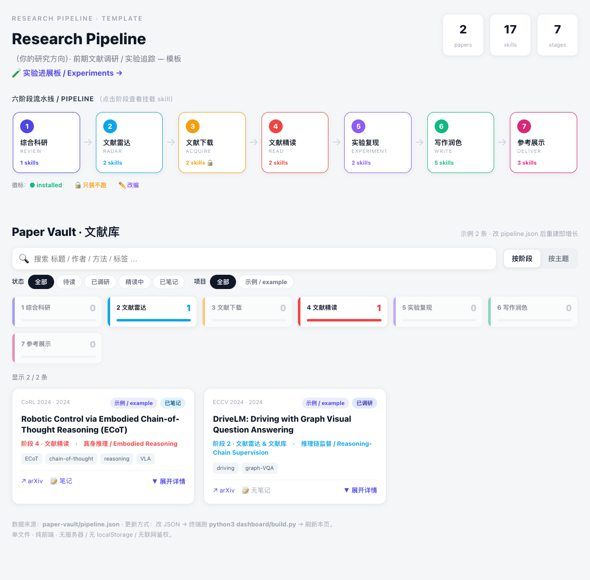
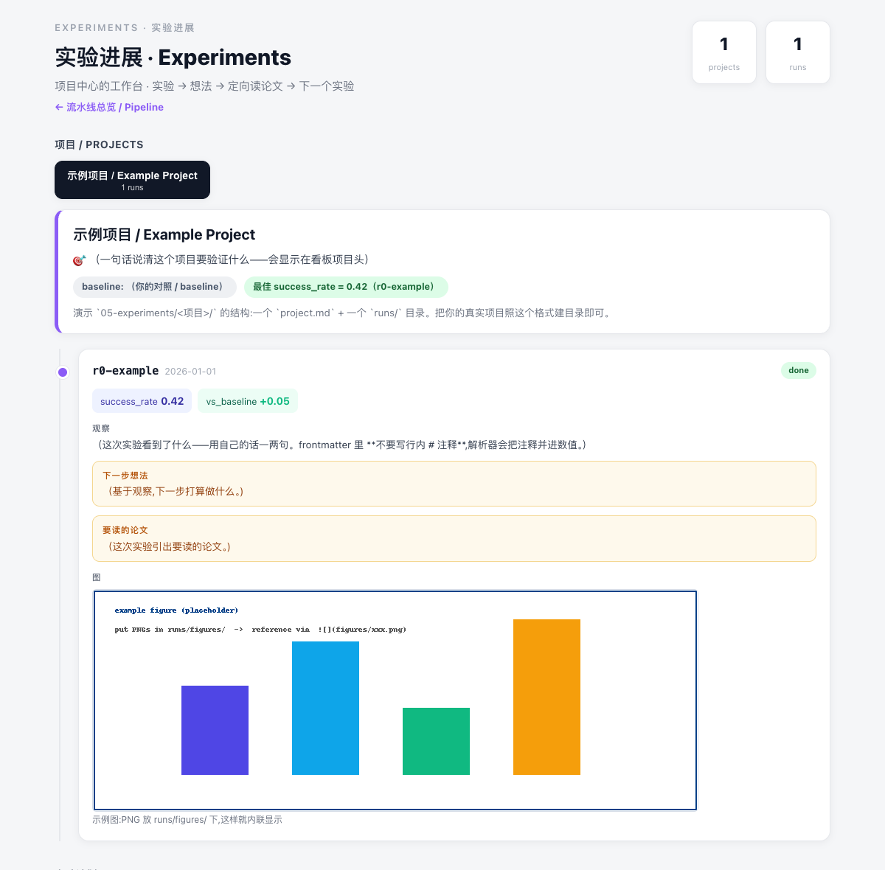

# Research Pipeline — 个人科研流水线(模板)

> 单文件、无服务器的个人科研工作台:**文献库 + 实验追踪**,配套一组 Claude Code skills。
> 数据是可编辑的 JSON / Markdown,跑一个 build 脚本注入进单页 HTML —— 双击即看、能进 git。




## 这是什么

- **文献库 (Paper Vault)** —— 论文沉淀成可检索卡片(按 阶段 / 主题 / 项目 / 状态 筛选,带摘要、标签、链接)。
- **实验追踪 (Experiments)** —— 每条实验是一个 Markdown(指标 + 观察 / 想法 / 要读的论文 + 内联图),汇成项目时间线;另有浏览器本地可编辑的实验计划看板。
- **7 阶段目录骨架 + 每阶段挂载的 skill**:选题 → 文献雷达 → 下载 → 精读 → 实验 → 写作 → 交付。

## 怎么用

**加一篇论文**:在 `paper-vault/pipeline.json` 的 `papers` 里加一个条目(字段照现有 ECoT / DriveLM 示例)→ 跑 `python3 dashboard/build.py` → 刷新 `pipeline.html`。

**加一次实验**:在 `05-experiments/<项目>/runs/` 放一个 md → 跑 `python3 dashboard/build-experiments.py` → 刷新 `experiments.html`。md 格式:

```markdown
---
project: my-project
run: r1-something
date: 2026-01-01
status: done          # done / running / queued / failed
metrics:
  success_rate: 0.42
  vs_baseline: +0.05
---
## 观察
…
## 下一步想法
…
## 图

```

图片放 `runs/figures/` 会自动**内联显示**(点击看大图)。整个循环就一句:**改数据 → 跑脚本 → 刷新网页。**

> ⚠️ frontmatter 是缩进式解析(非完整 YAML),**别在数值后写行内 `#` 注释** —— 注释会被并进数值里,导致指标变字符串、status 失效。说明写进正文。

## 目录结构

```
00-inbox/ … 07-delivery/      7 阶段骨架(选题/雷达/下载/精读/实验/写作/交付)
paper-vault/pipeline.json      文献库 + 阶段 + skill 的数据源
05-experiments/<项目>/         project.md + runs/*.md (+ runs/figures/)
dashboard/
  pipeline.html / experiments.html   两个单文件看板
  build.py / build-experiments.py    构建脚本(把数据注入 HTML)
```

## 依赖

- **Python 3**(标准库即可,**无第三方依赖**)—— 跑两个 build 脚本。
- 看板是纯 HTML,任意浏览器双击打开即可。

## 用到的 Skills(每阶段挂载)

> 均为第三方 Claude Code skill,本仓库**不含其代码**;按链接自行安装到 `.claude/skills/`。

**① 综合科研 / REVIEW**
- [academic-research-suite](https://github.com/Imbad0202/academic-research-skills-codex) —— 综述 / 选题 / 写作 / 模拟审稿 / 实验规划(含 `/ars-*` 命令)

**② 文献雷达 / RADAR**
- [daily-literature-digest](https://github.com/xuezheng627/daily-literature-digest-skill) —— 按关键词监控 arXiv / Crossref / OpenAlex,发每日文献日报
- [paper-vault](https://github.com/xuezheng627/research-radar-paper-vault) —— 把重点论文沉淀成本地可搜索卡片库

**③ 文献下载 / ACQUIRE**(手动触发,不自动跑)
- [literature-downloader](https://github.com/Lucaswangzcx/literature-downloader-skill) —— 中文文献检索 + 合法全文获取
- [sciencedirect-live-session-fetcher](https://github.com/Given-Dream/sciencedirect-live-session-fetcher) —— 用已登录浏览器会话取 ScienceDirect PDF

**④ 文献精读 / READ**
- [auto-paper-skill](https://github.com/Zachary709/AutoPaperSkill) —— 按方向 / 会议 / DOI 找论文、去重、存库、解析 PDF
- [literature-workflow](https://github.com/hwang847/codex-paper-reader) —— 管理本地 PDF、建索引、生成 HTML 精读笔记

**⑤ 实验复现 / EXPERIMENT**
- [codex-autoresearch](https://github.com/leo-lilinxiao/codex-autoresearch) —— 无人值守「改 → 验 → 留/弃」循环(复现 / 调参 / 通宵实验)
- [results-analysis](https://github.com/Boom5426/Nature-Paper-Skills) —— 分析实验结果、转成可入文的结果文字 / 图表

**⑥ 写作润色 / WRITE**
- [arxiv-paper-writer](https://github.com/renocrypt/latex-arxiv-SKILL) —— IEEEtran 写 arXiv 综述 + 管 BibTeX
- [scientific-writing](https://github.com/Boom5426/Nature-Paper-Skills) —— 按期刊规范写 / 改 manuscript、摘要、图注
- [conference-paper-writing](https://github.com/Boom5426/Nature-Paper-Skills) —— NeurIPS / ICML / ICLR / ACL / AAAI / COLM 会议论文
- [paper-reviewer](https://github.com/Boom5426/Nature-Paper-Skills) —— 以审稿人视角写 formal review
- [awesome-ai-research-writing](https://github.com/zengrong233/awesome-ai-research-writing-skill) —— 中英写作 / 翻译 / 润色 / 去 AI 味 / reviewer 自检

**⑦ 参考展示 / DELIVER**
- [chinese-reference-formatter-skill](https://github.com/Zechang-Xiong/chinese-reference-formatter-skill) —— GB/T 7714 中文参考文献 + BibTeX 补全
- [citation-ris-downloader](https://github.com/LiOH-1228/citation-ris-downloader) —— 下载 / 校验 / 整理 RIS → Zotero / EndNote / Mendeley
- [academic-slide-minimalist](https://github.com/fangyuanopus/literature-report-ppt-builder) —— 论文 → 文献汇报 PPT
